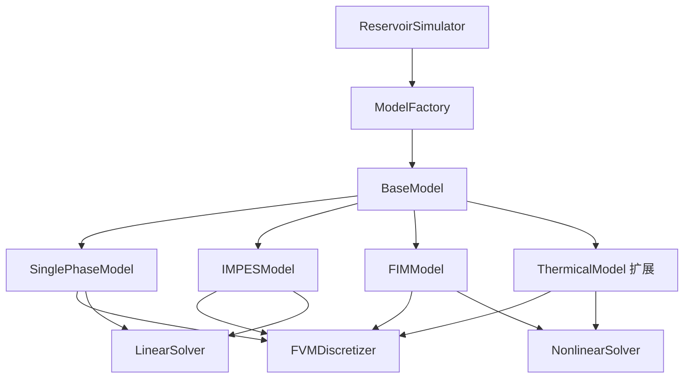

# 油藏数值模拟器 (Reservoir Simulator)

一个轻量级、模块化、可扩展的油藏数值模拟器软件包，支持单相流和两相流渗流方程求解。

## 🚀 主要特性

- **模块化设计**: 清晰的模块边界，易于维护和扩展
- **配置驱动**: YAML配置文件管理，支持不同模拟场景
- **功能完整**: 支持2D/3D单相流和两相流模拟
- **用户友好**: 简洁的API接口，丰富的可视化功能
- **工业标准**: 符合实际工程应用需求

## 📦 安装

### 从源码安装

```bash
git clone https://github.com/yourusername/reservoir-sim.git
cd reservoir-sim
pip install -e .
```

### 开发模式安装

```bash
pip install -e .[dev,viz]
```

## 🏗️ 项目结构

```
reservoirpy/
├── src/
│   └── reservoirpy/            # 油藏模拟器源代码
│       ├── __init__.py         # 包初始化
│       ├── core/               # 核心模块
│       │   ├── __init__.py
│       │   ├── discretization.py       # FVM离散化
│       │   ├── linear_solver.py        # 线性求解器
│       │   ├── nonlinear_solver.py     # 非线性求解器（两相流）
│       │   ├── simulator.py            # 主模拟器
│       │   ├── time_integration.py     # 时间积分
│       │   └── well_model.py           # 井模型
│       ├── mesh/                       # 网格模块
│       │   ├── __init__.py
│       │   └── mesh.py                 # 网格管理
│       ├── models/                     # 求解器模型
│       │   ├── __init__.py
│       │   ├── single_phase.py         # 单相流求解器
│       │   ├── two_phase_impes.py      # 两相流IMPES求解器
│       │   └── two_phase_fim.py        # 两相流FIM求解器
│       ├── physics/                    # 物理模型
│       │   ├── __init__.py
│       │   └── physics.py              # 物理属性模型
│       ├── utils/                      # 工具函数
│       │   ├── __init__.py
│       │   ├── io.py                   # 输入输出
│       │   ├── units.py                # 单位转换
│       │   └── validation.py           # 数据验证
│       ├── visualization/              # 可视化模块
│       │   ├── __init__.py
│       │   ├── plot_2d.py              # 2D可视化
│       │   ├── plot_3d.py              # 3D可视化
│       │   └── animation.py            # 动画生成
│       └── main.py             # 主入口
├── config/                     # 配置文件
│   ├── default_config.yaml     # 默认配置
│   └── examples/               # 示例配置
├── docs/                       # 文档
│   ├── api/                    # API文档
│   ├── tutorials/              # 教程
│   └── theory/                 # 理论文档
├── examples/                   # 示例脚本
│   ├── basical.py
│   └── simple_example.py
├── tests/                      # 测试
│   ├── __init__.py
│   ├── test_mesh.py
│   ├── test_physics.py
│   ├── test_solvers.py
│   └── test_visualization.py
├── main.py                     # 程序入口
├── setup.py                    # 安装脚本
└── README.md                   # 说明文档
```

## 🧩 核心模块详解

### 1. 网格模块 (`mesh/mesh.py`)

提供结构化矩形网格（2D/3D）的拓扑与几何信息，支持后续FVM离散。

主要类:
- `StructuredMesh`: 结构化网格管理类
- `CubeCell`: 网格单元类
- `Node`: 网格节点类

### 2. 物理属性模块 (`physics/physics.py`)

封装单相流和两相流动物理参数，为FVM提供物性输入。

主要类:
- `SinglePhaseProperties`: 单相流物理属性
- `TwoPhaseProperties`: 两相流物理属性（继承自单相流）

### 3. 离散化模块 (`core/discretization.py`)

实现有限体积法离散化，组装线性系统。

主要类:
- `FVMDiscretizer`: 有限体积法离散化器

### 4. 时间积分模块 (`core/time_integration.py`)

实现隐式欧拉等时间积分方法。

主要类:
- `ImplicitEulerIntegrator`: 隐式欧拉积分器

### 5. 线性求解器模块 (`core/linear_solver.py`)

提供多种线性求解器方法。

主要类:
- `LinearSolver`: 线性求解器

### 6. 非线性求解器模块 (`core/nonlinear_solver.py`)

实现牛顿-拉夫森方法等非线性求解器。

主要类:
- `NewtonRaphsonSolver`: 牛顿-拉夫森求解器

### 7. 井模型模块 (`core/well_model.py`)

实现Peaceman井模型，支持定产量和定井底流压两种控制方式。

主要类:
- `Well`: 井模型类
- `WellManager`: 井管理器类

### 8. 主模拟器 (`core/simulator.py`)

协调所有模块，提供用户友好的运行接口。

主要类:
- `ReservoirSimulator`: 油藏数值模拟器主类

## 🧮 数学模型架构 (新版)

### 设计理念

采用**策略模式 + 工厂模式**的架构设计，实现了清晰的模块分离和高度的可扩展性：

- **BaseModel**: 定义所有数学模型的统一接口
- **ModelFactory**: 负责根据配置创建具体模型实例  
- **ReservoirSimulator**: 作为Context，委托具体的数学计算给Model对象

### 架构优势

1. **职责分离**: 模拟器专注于流程控制，模型专注于数学计算
2. **易于扩展**: 添加新模型只需继承BaseModel并注册到工厂
3. **一致性**: 所有模型遵循相同的接口规范
4. **可测试性**: 模型独立且接口明确，便于单元测试

### 模型层次结构



### 1. 单相流模型 (SinglePhaseModel)

实现单相流渗流方程：`φ·c·∂p/∂t = ∇·(k/μ·∇p) + q`

**特点**：
- 只需求解压力方程
- 使用隐式时间积分
- 支持线性求解器

**适用场景**：
- 单一流体相态
- 压力衰竭开发
- 注水保压

### 2. 两相流IMPES模型 (IMPESModel)

实现隐式压力-显式饱和度方法：
- 第一步：隐式求解压力方程
- 第二步：显式更新饱和度方程

**特点**：
- 计算效率高
- 时间步长受CFL条件限制
- 适用于温和驱替过程

**适用场景**：
- 水驱油
- 气驱油（低压缩性）
- 饱和度变化较缓慢的情况

### 3. 两相流FIM模型 (FIMModel)

实现全隐式方法：
- 同时隐式求解压力和饱和度耦合系统
- 使用Newton-Raphson非线性求解器

**特点**：
- 无条件稳定
- 时间步长可以较大
- 计算成本较高

**适用场景**：
- 强烈耦合的多相流动
- 饱和度变化剧烈
- 高压缩性流体

## 🧮 求解器模块 (兼容旧版)

### 1. 单相流求解器 (`models/single_phase.py`)

实现单相流油藏模拟的完整求解流程。

主要类:
- `SinglePhaseSolver`: 单相流求解器

### 2. 两相流IMPES求解器 (`models/two_phase_impes.py`)

实现隐式压力-显式饱和度方法求解两相流问题。

主要类:
- `TwoPhaseIMPES`: IMPES求解器

### 3. 两相流FIM求解器 (`models/two_phase_fim.py`)

实现全隐式方法求解两相流问题。

主要类:
- `TwoPhaseFIM`: FIM求解器

## 📊 可视化模块

### 1. 2D可视化 (`visualization/plot_2d.py`)

提供2D压力场、饱和度场等的可视化功能。

主要类:
- `Plot2D`: 2D可视化器

### 2. 3D可视化 (`visualization/plot_3d.py`)

提供3D压力场、饱和度场等的可视化功能。

主要类:
- `Plot3D`: 3D可视化器

### 3. 动画生成 (`visualization/animation.py`)

提供模拟结果的动画生成功能。

主要类:
- `AnimationGenerator`: 动画生成器

## 🛠️ 工具模块

### 1. 输入输出 (`utils/io.py`)

提供配置文件读写、数据导入导出等功能。

### 2. 单位转换 (`utils/units.py`)

提供常用的油藏工程单位转换功能。

主要类:
- `UnitConverter`: 单位转换器

### 3. 数据验证 (`utils/validation.py`)

提供输入数据验证和结果验证功能。

主要类:
- `ConfigValidator`: 配置验证器

## 🚀 快速开始

### 基本使用

```
from reservoirpy import ReservoirSimulator

# 使用配置文件创建模拟器
simulator = ReservoirSimulator('config/default_config.yaml')

# 运行模拟
results = simulator.run_simulation()

# 获取结果
pressure_field = simulator.get_pressure_field()
```

### 程序化配置

```
from reservoirpy import ReservoirSimulator

# 使用字典配置
config = {
    'mesh': {
        'nx': 20, 'ny': 20, 'nz': 1,
        'dx': 10.0, 'dy': 10.0, 'dz': 5.0
    },
    'physics': {
        'permeability': 100.0,
        'porosity': 0.2,
        'viscosity': 0.001,
        'compressibility': 1e-9
    },
    'wells': [
        {'location': [0, 5, 5], 'control_type': 'rate', 'value': 0.001},
        {'location': [0, 15, 15], 'control_type': 'bhp', 'value': 1e6}
    ],
    'simulation': {
        'dt': 86400,
        'total_time': 31536000,
        'initial_pressure': 30e6
    }
}

simulator = ReservoirSimulator(config_dict=config)
results = simulator.run_simulation()
```

### 网格和物理属性

```
from reservoirpy.mesh.mesh import StructuredMesh
from reservoirpy.physics.physics import SinglePhaseProperties

# 创建网格
mesh = StructuredMesh(nx=20, ny=20, nz=1, dx=10.0, dy=10.0, dz=5.0)

# 创建物理属性
physics = SinglePhaseProperties(mesh, {
    'permeability': 100.0,  # mD
    'porosity': 0.2,
    'viscosity': 0.001,     # Pa·s
    'compressibility': 1e-9  # 1/Pa
})
```

## 📊 示例

运行示例脚本：

```
python examples/basical.py
```

这将创建一个网格并展示基本的可视化功能。

## 🔧 配置

配置文件使用YAML格式，主要包含以下部分：

- **mesh**: 网格配置
- **physics**: 物理属性
- **wells**: 井配置
- **simulation**: 模拟参数
- **linear_solver**: 线性求解器配置
- **visualization**: 可视化配置

详细配置说明请参考 `config/default_config.yaml`。

## 🧪 测试

运行测试：

```
pytest tests/
```

## 📚 文档

- [API文档](docs/api/)
- [教程](docs/tutorials/)
- [理论背景](docs/theory/)

## 🤝 贡献

欢迎贡献代码！请查看 [CONTRIBUTING.md](CONTRIBUTING.md) 了解详细信息。

## 📄 许可证

本项目采用 MIT 许可证。详见 [LICENSE](LICENSE) 文件。

## 🙏 致谢

感谢所有为这个项目做出贡献的开发者和研究人员。

## 📞 联系方式

- 项目主页: https://github.com/yourusername/reservoir-sim
- 问题反馈: https://github.com/yourusername/reservoir-sim/issues
- 邮箱: reservoir@example.com

---

*基于重构后的模块化架构，提供了更清晰的代码组织结构和更好的可扩展性。*