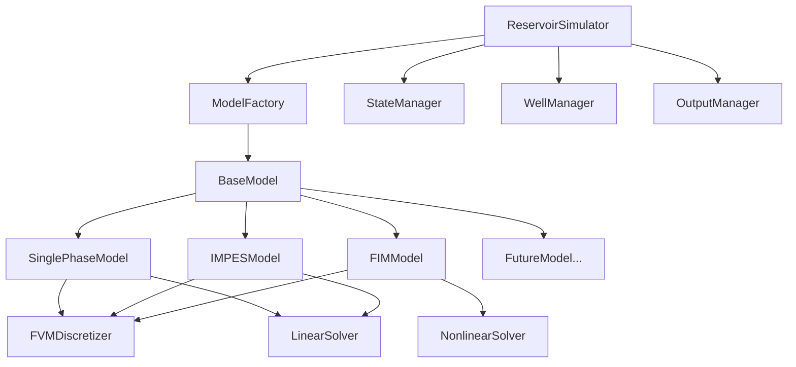

# ReservoirPy 架构设计文档

## 1. 设计目标

- **模块化**：各模块职责清晰，低耦合高内聚
- **可扩展性**：易于添加新的数学模型和求解方法
- **一致性**：统一的接口和流程规范
- **可维护性**：代码结构清晰，便于调试和优化

## 2. 总体架构

### 2.1 架构图



### 2.2 设计模式应用

1. **策略模式 (Strategy Pattern)**
   - `ReservoirSimulator`作为Context
   - `BaseModel`作为Strategy接口
   - 具体模型作为ConcreteStrategy

2. **工厂模式 (Factory Pattern)**
   - `ModelFactory`负责创建模型实例
   - 支持注册新模型类型

3. **模板方法模式 (Template Method Pattern)**
   - `BaseModel`定义求解骨架流程
   - 子类实现具体数学计算

## 3. 核心类设计

### 3.1 BaseModel 抽象基类

```python
from abc import ABC, abstractmethod
from typing import Dict, Any, Tuple
import numpy as np
from scipy.sparse import csr_matrix

class BaseModel(ABC):
    """
    油藏数值模拟模型抽象基类
    
    定义所有数学模型必须实现的接口和通用流程
    """
    
    def __init__(self, mesh, physics, config):
        self.mesh = mesh
        self.physics = physics  
        self.config = config
        self.discretizer = None
        self.solver = None
        
    @abstractmethod
    def get_state_variables(self) -> List[str]:
        """返回模型的状态变量列表"""
        pass
        
    @abstractmethod
    def assemble_system(self, dt: float, state_vars: Dict[str, np.ndarray], 
                       well_manager) -> Tuple[csr_matrix, np.ndarray]:
        """组装线性系统 A*x = b"""
        pass
        
    @abstractmethod
    def solve_timestep(self, dt: float, state_vars: Dict[str, np.ndarray],
                      well_manager) -> Dict[str, np.ndarray]:
        """求解单个时间步"""
        pass
        
    @abstractmethod
    def update_properties(self, state_vars: Dict[str, np.ndarray]) -> None:
        """更新物理属性"""
        pass
        
    @abstractmethod
    def validate_solution(self, state_vars: Dict[str, np.ndarray]) -> bool:
        """验证解的合理性"""
        pass
        
    # 模板方法定义通用求解流程
    def solve_simulation(self, initial_state: Dict[str, np.ndarray],
                        dt: float, total_time: float, 
                        well_manager, output_manager) -> Dict[str, Any]:
        """
        模拟求解的模板方法
        定义通用的时间循环和输出流程
        """
        current_time = 0.0
        time_step = 0
        state_vars = initial_state.copy()
        
        # 保存初始状态
        output_manager.save_timestep(0, current_time, state_vars)
        
        while current_time < total_time:
            time_step += 1
            current_time += dt
            
            # 求解一个时间步（由子类实现）
            state_vars = self.solve_timestep(dt, state_vars, well_manager)
            
            # 验证解
            if not self.validate_solution(state_vars):
                raise RuntimeError(f"Solution validation failed at timestep {time_step}")
            
            # 更新物理属性  
            self.update_properties(state_vars)
            
            # 保存结果
            output_manager.save_timestep(time_step, current_time, state_vars)
            
        return output_manager.get_results()
```

### 3.2 具体模型实现

#### SinglePhaseModel

```python
class SinglePhaseModel(BaseModel):
    """单相流模型"""
    
    def get_state_variables(self) -> List[str]:
        return ['pressure']
        
    def assemble_system(self, dt: float, state_vars: Dict[str, np.ndarray],
                       well_manager) -> Tuple[csr_matrix, np.ndarray]:
        pressure = state_vars['pressure']
        return self.discretizer.discretize_single_phase(dt, pressure, well_manager)
        
    def solve_timestep(self, dt: float, state_vars: Dict[str, np.ndarray],
                      well_manager) -> Dict[str, np.ndarray]:
        A, b = self.assemble_system(dt, state_vars, well_manager)
        new_pressure = self.solver.solve(A, b)
        return {'pressure': new_pressure}
        
    def update_properties(self, state_vars: Dict[str, np.ndarray]) -> None:
        # 更新网格单元压力
        pressure = state_vars['pressure']
        for i, cell in enumerate(self.mesh.cell_list):
            cell.press = pressure[i]
            
    def validate_solution(self, state_vars: Dict[str, np.ndarray]) -> bool:
        pressure = state_vars['pressure']
        return not np.any(np.isnan(pressure)) and np.all(pressure > 0)
```

#### IMPESModel

```python
class IMPESModel(BaseModel):
    """两相流IMPES模型（隐式压力-显式饱和度）"""
    
    def get_state_variables(self) -> List[str]:
        return ['pressure', 'saturation']
        
    def solve_timestep(self, dt: float, state_vars: Dict[str, np.ndarray],
                      well_manager) -> Dict[str, np.ndarray]:
        # 第一步：隐式求解压力
        A, b = self.assemble_pressure_system(dt, state_vars, well_manager)
        new_pressure = self.solver.solve(A, b)
        
        # 第二步：显式更新饱和度
        new_saturation = self.update_saturation_explicit(
            dt, state_vars, {'pressure': new_pressure}, well_manager)
            
        return {
            'pressure': new_pressure,
            'saturation': new_saturation
        }
```

### 3.3 ModelFactory

```python
class ModelFactory:
    """模型工厂类"""
    
    _registry = {}
    
    @classmethod
    def register(cls, model_type: str, model_class):
        """注册模型类"""
        cls._registry[model_type] = model_class
        
    @classmethod
    def create_model(cls, model_type: str, mesh, physics, config) -> BaseModel:
        """创建模型实例"""
        if model_type not in cls._registry:
            raise ValueError(f"Unknown model type: {model_type}")
            
        model_class = cls._registry[model_type]
        return model_class(mesh, physics, config)

# 注册内置模型
ModelFactory.register('single_phase', SinglePhaseModel)
ModelFactory.register('two_phase_impes', IMPESModel)
ModelFactory.register('two_phase_fim', FIMModel)
```

### 3.4 重构后的ReservoirSimulator

```python
class ReservoirSimulator:
    """
    油藏数值模拟器主类
    
    采用策略模式，将具体的数学模型委托给Model对象处理
    """
    
    def __init__(self, config_path: str = None, config_dict: Dict = None):
        self.config = self._load_config(config_path, config_dict)
        
        # 创建基础组件
        self.mesh = self._create_mesh()
        self.physics = self._create_physics()
        self.well_manager = self._create_well_manager()
        self.output_manager = OutputManager(self.config.get('output', {}))
        
        # 通过工厂创建模型
        model_type = self.config['physics']['type']
        self.model = ModelFactory.create_model(
            model_type, self.mesh, self.physics, self.config)
            
    def run_simulation(self) -> Dict[str, Any]:
        """运行模拟"""
        # 初始化状态变量
        initial_state = self._initialize_state()
        
        # 获取模拟参数
        sim_config = self.config['simulation']
        dt = sim_config['dt']
        total_time = sim_config['total_time']
        
        # 委托给模型执行求解
        return self.model.solve_simulation(
            initial_state, dt, total_time, 
            self.well_manager, self.output_manager)
            
    def _initialize_state(self) -> Dict[str, np.ndarray]:
        """初始化状态变量"""
        state_vars = {}
        sim_config = self.config['simulation']
        
        # 根据模型类型初始化不同的状态变量
        for var_name in self.model.get_state_variables():
            if var_name == 'pressure':
                initial_pressure = sim_config.get('initial_pressure', 30e6)
                state_vars['pressure'] = np.full(self.mesh.n_cells, initial_pressure)
            elif var_name == 'saturation':
                initial_saturation = sim_config.get('initial_saturation', 0.2)
                state_vars['saturation'] = np.full(self.mesh.n_cells, initial_saturation)
                
        return state_vars
```

## 4. 目录结构重组

```
src/reservoirpy/
├── models/
│   ├── __init__.py
│   ├── base_model.py           # BaseModel抽象基类
│   ├── model_factory.py        # ModelFactory工厂类
│   ├── state_manager.py        # 状态变量管理
│   ├── single_phase/
│   │   ├── __init__.py
│   │   └── single_phase_model.py
│   └── two_phase/
│       ├── __init__.py
│       ├── impes_model.py      # IMPES方法
│       └── fim_model.py        # FIM方法
├── core/
│   ├── simulator.py            # 重构后的主模拟器
│   ├── discretization.py       # FVM离散器
│   ├── linear_solver.py        # 线性求解器
│   ├── nonlinear_solver.py     # 非线性求解器
│   ├── well_model.py           # 井模型
│   └── output_manager.py       # 输出管理器
└── ...
```

## 5. 扩展性设计

### 5.1 添加新模型

添加新的数学模型只需要：

1. 继承`BaseModel`
2. 实现抽象方法
3. 注册到工厂

```python
class ThermicalModel(BaseModel):
    """热采模型"""
    
    def get_state_variables(self) -> List[str]:
        return ['pressure', 'temperature', 'saturation']
        
    # 实现其他抽象方法...

# 注册新模型
ModelFactory.register('thermal', ThermicalModel)
```

### 5.2 配置驱动

```yaml
physics:
  type: 'thermal'  # 指定模型类型
  temperature_dependent: true
  heat_source: true
```

## 6. 优势总结

1. **职责清晰**：模拟器负责流程控制，模型负责数学计算
2. **易于扩展**：添加新模型无需修改现有代码
3. **一致性**：所有模型遵循统一接口
4. **可测试性**：模型独立，便于单元测试
5. **配置驱动**：通过配置文件选择模型类型

这种架构设计为ReservoirPy的长期发展奠定了坚实的基础，支持灵活的功能扩展和维护。