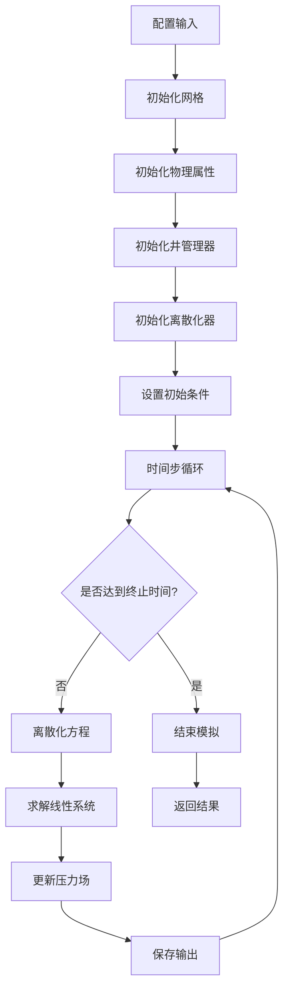
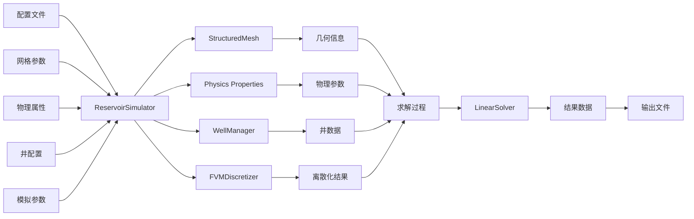

# 数值模拟流程详解

本文档详细说明了油藏数值模拟器的工作流程，包括各个组件的作用和相互关系。

## 整体流程图

## 详细步骤说明

### 1. 配置输入
- 读取用户配置文件或程序化配置
- 配置包括网格参数、物理属性、井信息、模拟参数等

### 2. 初始化网格 (StructuredMesh)
- 根据配置创建结构化网格
- 生成网格节点和单元
- 计算几何属性（体积、面积、距离等）

### 3. 初始化物理属性 (SinglePhaseProperties/TwoPhaseProperties)
- 根据配置初始化渗透率、孔隙度等物理参数
- 创建物理属性数组
- 将物理属性分配给各个网格单元

### 4. 初始化井管理器 (WellManager)
- 根据配置创建井对象
- 初始化井的产能指数
- 管理所有井的操作

### 5. 初始化离散化器 (FVMDiscretizer)
- 创建有限体积法离散化器
- 计算传导率矩阵
- 准备离散化操作

### 6. 设置初始条件
- 初始化压力场
- 设置边界条件
- 准备时间步循环

### 7. 时间步循环
#### 7.1 离散化方程
- 使用有限体积法离散化控制方程
- 构建系数矩阵和右端向量

#### 7.2 求解线性系统
- 使用线性求解器求解方程组
- 得到新的压力场

#### 7.3 更新压力场
- 更新网格单元中的压力值
- 更新其他相关属性

#### 7.4 保存输出
- 根据输出间隔保存结果
- 记录时间历史数据

### 8. 结束模拟
- 达到终止时间后结束模拟
- 返回完整的模拟结果

## 主要组件说明

### StructuredMesh（网格）
- 负责网格生成和几何计算
- 提供网格拓扑信息
- 计算单元体积、界面面积等几何属性

### Physics Properties（物理属性）
- 管理油藏的物理参数
- 包括渗透率、孔隙度、粘度等
- 提供物理属性的计算方法

### WellManager（井管理器）
- 管理所有井对象
- 计算井的产能指数
- 处理井的边界条件

### FVMDiscretizer（离散化器）
- 实现有限体积法离散化
- 构建线性系统
- 提供求解接口

### LinearSolver（线性求解器）
- 求解大型稀疏线性系统
- 支持多种求解方法（直接法、迭代法等）

## 数据流向图

## 关键设计原则

1. **模块化设计**：每个组件职责单一，易于维护和扩展
2. **配置驱动**：通过配置文件或字典驱动模拟过程
3. **接口清晰**：组件间通过明确定义的接口交互
4. **可扩展性**：支持单相流和两相流等多种物理模型
5. **可视化支持**：提供结果可视化功能

通过以上流程和组件协作，油藏数值模拟器能够高效地进行油藏模拟计算，并输出用户需要的结果。